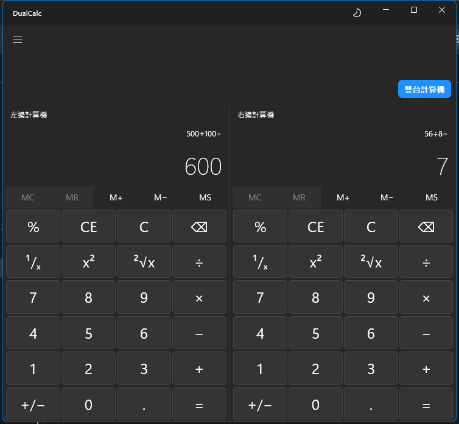
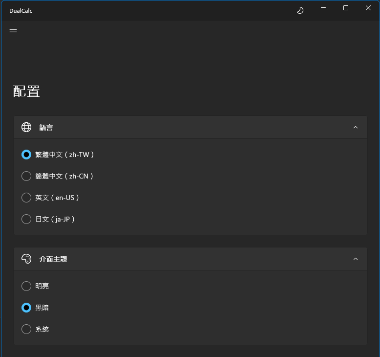

# DualCalc

雙欄對照計算機 — WinUI 3 + C# + Windows App SDK




## 功能特色

- **雙欄模式**：點擊 Toolbar 上的開關，即時展開/收起第二個計算機，並會根據設定自動調整視窗大小，顏色狀態與提示也會動態切換。
- **配置讀取**：新增 `config.yaml` 支援預設視窗大小與單/雙欄啟動配置，且在配置頁也新增相關對應邏輯。
- **先乘除後加減**：Shunting-yard 算法，完整支援運算子優先級。
- **語系切換**：配置頁即時切換，所有 UI 文字（包含動態更新的提示）自動連動。
- **三種主題**：系統 / 明亮 / 黑暗，即時生效不需重啟。
- **Memory 功能**：MC / MR / M+ / M− / MS。

---

## 環境需求

| 工具 | 版本 |
| ------ | ------ |
| Visual Studio | 2026 18.5+ |
| Windows App SDK | 2.0+ |
| .NET | 10.0 |
| Windows | 10 1809 (build 17763)+ |

### VS 工作負載

- **Windows 應用程式開發** (Windows application development)
- .NET 桌面開發

---

## 開始使用

```bash
# 1. Clone 專案
git clone https://github.com/m121752332/DualCalc.git
cd DualCalc

# 2. 用 Visual Studio 2022 或 Visual Studio 2026 開啟
#    開啟 DualCalc.sln

# 3. 選擇平台 x64 → 執行 (F5)
```

---

## 專案結構

```xml
DualCalc/
├── Models/
│   └── CalculatorEngine.cs      # Shunting-yard 計算核心
├── ViewModels/
│   ├── CalculatorViewModel.cs   # 單一計算機狀態
│   ├── MainViewModel.cs         # 雙欄切換邏輯
│   └── SettingsViewModel.cs     # 語言 + 主題設定
├── Views/
│   ├── CalculatorView.xaml      # 計算機 UI 元件
│   ├── SettingsView.xaml        # 配置頁
│   └── AboutView.xaml           # 關於頁
├── Services/
│   ├── ConfigService.cs         # config.yaml 參數讀取服務
│   ├── LocalizationService.cs   # 繁簡切換服務
│   └── ThemeService.cs          # 主題切換服務
├── Converters/
│   └── BoolToVisibilityConverter.cs
├── i18n/
│   ├── en-US.json               # 英文語系字典
│   ├── ja-JP.json               # 日文語系字典
│   ├── zh-CN.json               # 簡體中文語系字典
│   └── zh-TW.json               # 繁體中文語系字典
└── config.yaml                  # 系統全域應用配置檔
```

---

## 更新日誌 (Changelog)

詳細的異動紀錄（包含新功能與優化項目）已移至獨立文件管理，請參閱：
👉 **[docs/Changelog.md](docs/Changelog.md)**

---

## 本次補充更新

### 1. 語系與配置調整

- 專案已全面調整語系架構，由原本的 `.resw` 資源檔遷移至 `DualCalc/i18n/*.json` 的字典讀取機制。
- 支援了「繁體中文（zh-TW）」、「簡體中文（zh-CN）」、「英文（en-US）」以及「日文（ja-JP）」四種語言介面。
- `config.yaml` 的預設語言已改為新架構支援的名稱，並維持對外設定值的保存一致性。
- 配置頁中的語系選項目前顯示為：
  - `繁體中文（zh-TW）`
  - `簡體中文（zh-CN）`
  - `英文（en-US）`
  - `日文（ja-JP）`

### 2. 打包與發佈補充

- `publish.ps1` 打包流程已驗證可正常輸出 x64 / arm64 單一執行檔。
- 先前的 PRI 預設語言警告，已透過將專案 `DefaultLanguage` 調整為 `zh-TW` 解決。
- 先前的 trimming 警告，已透過停用 `PublishTrimmed` 排除，以降低 WinUI / WinRT / YamlDotNet 在發佈後的執行期風險。
- `Assets/Logo.jpg` 已設定為隨輸出與 publish 一併複製，避免 `About` 頁圖片遺失。

### 3. 主視窗尺寸行為

- 主視窗不再允許被縮到破壞版面的尺寸。
- 最小高度會依 `config.yaml` 的 `defaultAppHeight` 限制。
- 最小寬度會依目前模式動態切換：
  - 單欄模式：以單台計算機配置寬度為下限
  - 雙欄模式：以雙台計算機配置寬度為下限

### 4. 備註

- 目前專案語系切換的實際顯示來源為 `LocalizationService` 讀取 `i18n` 目錄下的 JSON 字典檔案為主，若讀取失敗則會有防錯機制或介面上的 Error InfoBar 提示。

---

## 技術棧

| 層 | 技術 |
| ---- | ------ |
| **前端** | WinUI 3 / Windows App SDK 2.0 |
| **後端** | C# 12 / .NET 10 |
| **架構** | MVVM + x:Bind |
| **計算引擎** | Shunting-yard Algorithm |
| **主題** | Mica Backdrop + ElementTheme |
| **本地化** | JSON 多語系架構 |
| **配置檔** | YamlDotNet |

---

## 開發里程碑

- [x] Phase 1 — 專案架構 + CalculatorEngine + 所有 ViewModel / Service
- [x] Phase 2 — UI 細節調整 + 動畫
- [ ] Phase 3 — 鍵盤輸入支援
- [x] Phase 4 — 打包發布

---

## 打包發布

本專案支援將應用程式打包成乾淨的單一獨立執行檔（包含一切相依性，只需 `.exe` 原地執行），並支援 x64 與 arm64 兩種架構。

只要在命令列或 PowerShell 中執行已經撰寫好的打包腳本即可：

```powershell
.\publish.ps1
```

執行後會自動清理 `bin` / `obj`，並產出打包檔案至：

- **x64:** `DualCalc\bin\Release\net10.0-windows10.0.19041.0\win-x64\publish\`
- **arm64:** `DualCalc\bin\Release\net10.0-windows10.0.19041.0\win-arm64\publish\`

請記得將打包產出的 `DualCalc.exe` 與根目錄的 `config.yaml` 放在相同的目錄層級進行散佈發布，確保應用程式能正確讀取初始配置。若仍出現讀取問題，程式會跳出彈窗提示錯誤原因。

---

© 2026 DualCalc
